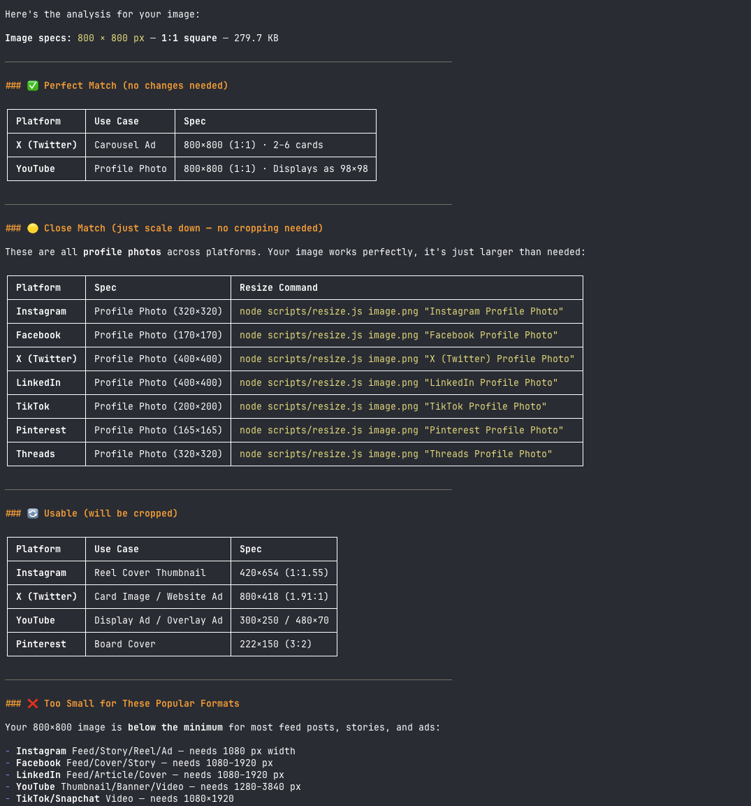
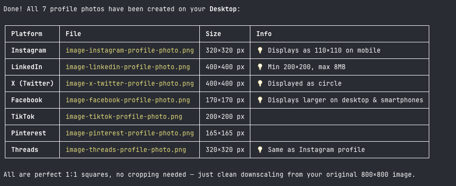

# Branding5 Agent Skills

Free, open-source AI agent skills from [Branding5](https://www.branding5.com).

---

## Skills

### 📐 social-media-image-sizes

> Check and resize images for every major social media platform.

Validates image dimensions against 60+ specs across Instagram, Facebook, X (Twitter), LinkedIn, TikTok, YouTube, Pinterest, Snapchat, and Threads. Outputs a ranked match list and generates correctly-sized exports via [sharp](https://sharp.pixelplumbing.com/).

**Install:**

```bash
npx skills add Branding5/agent-skills@social-media-image-sizes
```

**Use when a user asks:**

- _"Is this image the right size for Instagram?"_
- _"Resize this photo for a LinkedIn banner"_
- _"What size should my YouTube thumbnail be?"_
- _"Prep these assets for Facebook ads"_
- _"Check if my image fits the TikTok spec"_

**Check an image:**

```bash
node scripts/check.js image.png
```



**Resize to a named spec:**

```bash
node scripts/resize.js image.png "Instagram Profile Photo"
```



**Platforms covered:**

| Platform    | Specs                                                                    |
| ----------- | ------------------------------------------------------------------------ |
| Instagram   | Profile, Feed (portrait/square/landscape), Stories, Reels, Carousel, Ads |
| Facebook    | Profile, Cover, Feed, Stories, Reels, Events, Groups, Ads                |
| X (Twitter) | Profile, Header, Posts, Cards, Ads                                       |
| LinkedIn    | Profile, Background, Company, Feed, Articles, Newsletters, Ads           |
| TikTok      | Profile, Videos, Ads                                                     |
| YouTube     | Profile, Banner, Thumbnails, Shorts, Community, Ads                      |
| Pinterest   | Profile, Boards, Standard/Square/Long/Idea Pins, Ads                     |
| Snapchat    | Snaps, Spotlight, Stories, Ads, Filters/Lenses                           |
| Threads     | Profile, Posts                                                           |

→ [View skill](./skills/social-media-image-sizes/SKILL.md) · [Full reference](./skills/social-media-image-sizes/AGENTS.md) · [Interactive tool](https://www.branding5.com/tools/social-media-cheat-sheet)

---

## Structure

Each skill lives in its own directory:

```
skills/
└── <skill-name>/
    ├── SKILL.md          # Frontmatter + agent instructions
    ├── AGENTS.md         # Full compiled reference (single-file context)
    ├── scripts/          # Executable tools
    ├── references/       # Per-platform detail, loaded on demand
    └── package.json      # Dependencies (if any)
```

## Installation

Install a single skill:

```bash
npx skills add Branding5/agent-skills@social-media-image-sizes
```

Install globally so it's available in every project:

```bash
npx skills add Branding5/agent-skills@social-media-image-sizes -g
```

## Contributing

Bug reports and pull requests welcome. If a platform updates its specs, open an issue or PR against the relevant file in `skills/social-media-image-sizes/references/` and `skills/social-media-image-sizes/scripts/platform-data.js`.

## License

MIT — free to use, fork, and redistribute.

---

_Skills built alongside [Branding5](https://www.branding5.com) — AI brand positioning and marketing strategy_
